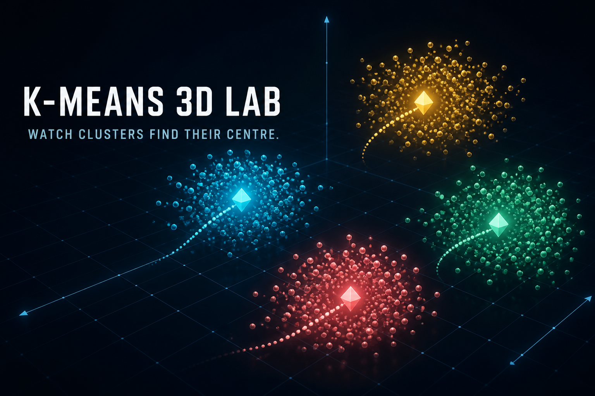
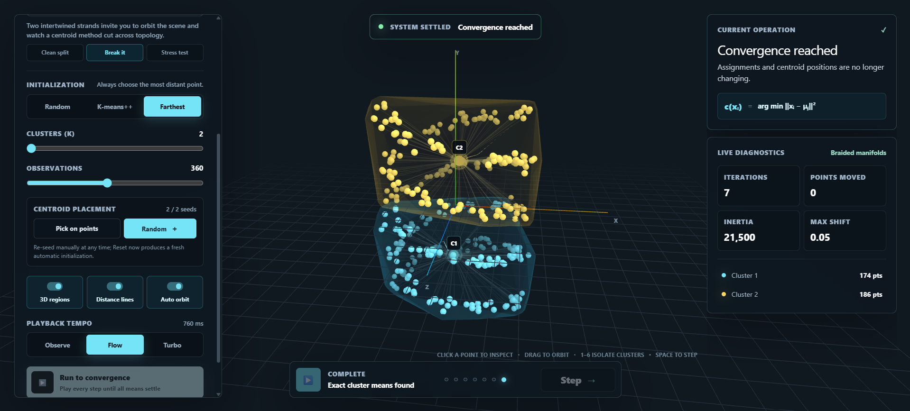

<h1 align="center">K-Means 3D Lab</h1>

<p align="center">
  An interactive, step-by-step 3D visualization of the K-means clustering algorithm.
</p>

<div align="center">
  
  
  
  
  
  
</div>

<br />

<p align="center">
  
</p>

## Live demo

Explore the production version at **[k-means-3d-lab.zmaqutu.chatgpt.site](https://k-means-3d-lab.zmaqutu.chatgpt.site)**.

K-Means 3D Lab turns the alternating assignment and centroid-update phases of K-means into a spatial experiment. Run the algorithm automatically, advance one operation at a time, choose the initial centroids, inspect observations, and deliberately test the algorithm on datasets it handles poorly.

<p align="center">
  
</p>

## Highlights

- **Step-by-step playback** — alternate between assigning observations and moving centroids to their cluster means.
- **Automatic convergence** — play every operation until assignments and centroid positions settle.
- **Three initialization strategies** — compare random, K-means++, and farthest-point seeding.
- **Manual centroid placement** — click observations in the scene to create the starting configuration you want.
- **13 datasets** — move from clean Gaussian clouds to ribbons, moons, shells, outliers, noise, and braided manifolds.
- **Adjustable experiments** — select 2–6 clusters and generate 160–600 observations.
- **Cluster-wide 3D hulls** — translucent envelopes reveal the full spatial extent of each assigned group.
- **Point inspection** — pin an observation to read its coordinates, assignment, and distance from its centroid.
- **Cluster isolation** — click a cluster in the diagnostics panel or press `1`–`6` to focus on it.
- **Live diagnostics** — follow inertia, moved observations, maximum centroid shift, cluster sizes, and iteration count.
- **Scene controls** — toggle hulls, distance lines, and automatic orbiting independently.
- **Playback tempo** — choose Observe, Flow, or Turbo speed without changing the algorithm.
- **Fresh experiments** — reset an initialization, generate a new sample, or launch a surprise dataset.

## How K-means is visualized

1. **Initialize centroids** using random selection, K-means++, farthest-point selection, or manual placement.
2. **Assign every observation** to the centroid with the smallest squared Euclidean distance.
3. **Update each centroid** to the mean position of its assigned observations.
4. **Repeat** until assignments and centroid positions no longer change.

The interface deliberately separates assignment and update into individual operations. This makes it possible to see *why* the algorithm converges rather than only viewing the final partition.

## Dataset laboratory

| Dataset | Recommended K | What it demonstrates |
| --- | ---: | --- |
| Aurora archipelago | 5 | A spacious, clearly separated opening example. |
| Original eight points | 3 | The source coordinates from the original Python implementation. |
| Gaussian constellations | 4 | Compact, similarly sized groups that suit K-means well. |
| Unequal constellations | 4 | Groups with sharply different density and variance. |
| Anisotropic ribbons | 3 | Rotated, elongated clouds that challenge spherical assumptions. |
| Overlapping currents | 3 | Crossing distributions with ambiguous nearest-centroid boundaries. |
| Interlocking moons | 2 | A classic non-convex failure case. |
| Double helix | 2 | Intertwined manifolds whose topology cannot be preserved by centroid partitions. |
| Island bridges | 3 | Dense groups connected by sparse points that pull the means. |
| Signal lattice | 6 | Nine micro-clusters for experimenting with the choice of K. |
| Concentric shells | 3 | Nested layers with no useful centre-based split. |
| Outlier gravity | 4 | Stable clusters distorted by a small number of extreme observations. |
| No structure | 4 | Uniform noise that K-means must partition despite having no natural groups. |

The curated **Clean split**, **Break it**, and **Stress test** shortcuts provide useful starting points. **Surprise me** selects a different dataset and generates a fresh sample.

## Controls

| Input | Action |
| --- | --- |
| Drag | Orbit the 3D scene |
| Scroll | Zoom in or out |
| Click an observation | Pin and inspect it |
| `Space` | Advance one algorithm operation |
| `A` | Start or pause automatic playback |
| `R` | Reset with a fresh centroid initialization |
| `1`–`6` | Isolate the corresponding cluster |
| `Esc` | Clear the pinned point and cluster focus |

## Technology stack

- **React 19** for the interactive interface and state model.
- **TypeScript** for the dataset, clustering, and scene contracts.
- **Three.js** for geometry, materials, lighting, convex hulls, and the 3D coordinate space.
- **React Three Fiber** for rendering the Three.js scene through React.
- **Drei** for camera controls, HTML scene labels, and centroid motion trails.
- **Tailwind CSS / PostCSS** as part of the styling toolchain, with the product UI authored in custom CSS.
- **Vite + Vinext** for development, production builds, and the React Server Components-compatible runtime.
- **OpenAI Sites / Cloudflare Workers** for the hosted production build.

## Getting started

### Requirements

- Node.js `22.13.0` or newer
- npm

### Install and run

```bash
git clone https://github.com/zmaqutu/k-means-clustering-visualization.git
cd k-means-clustering-visualization
npm ci
npm run dev
```

Open [http://localhost:3000](http://localhost:3000).

### Production build

```bash
npm run build
npm start
```

### Tests

```bash
npm test
```

The test command creates a production build and runs the rendered-HTML checks.

## Project structure

```text
app/
├── KMeansLab.tsx        # Algorithm, datasets, Three.js scene, and interactions
├── globals.css          # Responsive interface and visual system
├── layout.tsx           # Metadata, fonts, and root layout
└── page.tsx             # Application entry route
public/                  # Social preview and browser assets
readmeAssets/            # Images used by this README
tests/                   # Rendered output checks
.github/workflows/       # GitHub Pages deployment workflow
.openai/hosting.json     # Sites project configuration
```

## Deployment

The repository supports two deployment targets:

- `npm run build` creates the Sites/Vinext production output.
- `npm run build:pages` creates the static GitHub Pages output in `dist-pages`.

Pushes to `main` run `.github/workflows/deploy-pages.yml`. To enable GitHub Pages, select **Settings → Pages → Source → GitHub Actions** in the repository.

## Project lineage

This experience expands the original [machine-learning-k-means-clustering](https://github.com/zmaqutu/machine-learning-k-means-clustering) Python project into a real-time 3D learning environment. The original eight-point dataset remains available in the selector.

## Contributing

Contributions are welcome.

1. Fork the repository.
2. Create a focused feature branch.
3. Make and validate your changes.
4. Open a pull request describing the behavior and visual impact.

Useful contribution areas include new educational datasets, accessible interaction improvements, performance work for larger point clouds, and additional clustering diagnostics.

## Future ideas

- Timeline scrubbing to revisit earlier assignments and centroid positions.
- Side-by-side runs for comparing initialization strategies.
- Exportable experiment snapshots and shareable configurations.
- Additional clustering algorithms such as K-medoids, DBSCAN, and Gaussian mixture models.
- Optional animated walkthrough recordings for each failure-case dataset.

<p align="center">Made with care in React, TypeScript, and Three.js.</p>
